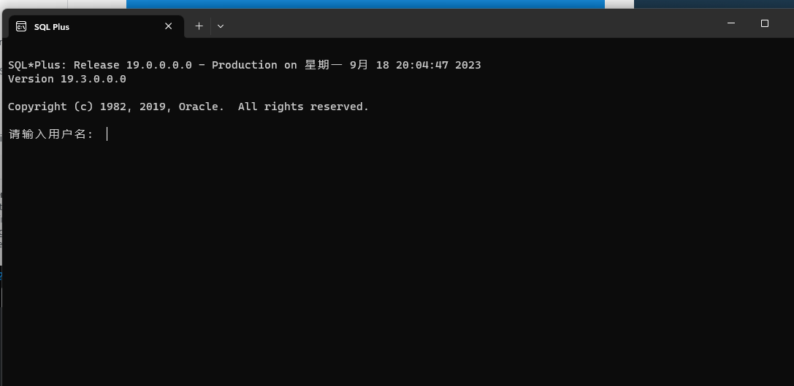
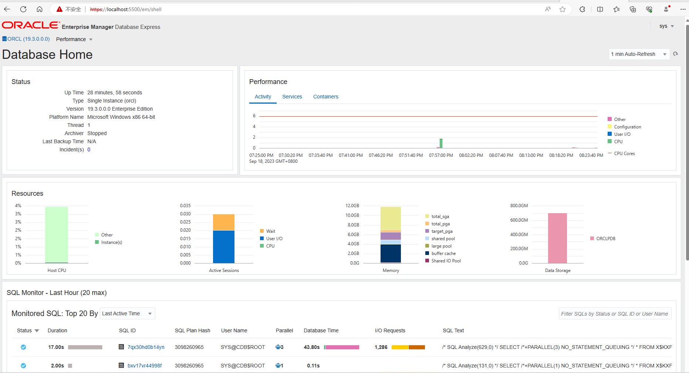
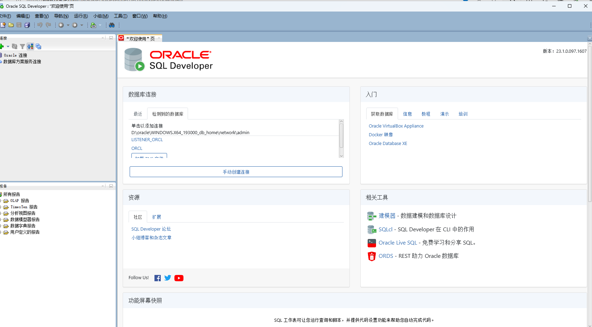

### Oracle learning

参考书目：

《oracle数据库应用与实训教程》《oracle19c 数据库应用》

#### session1 安装

下载

位置其实挺难找的：

[数据库软件下载 |神谕 (oracle.com)](https://www.oracle.com/database/technologies/oracle-database-software-downloads.html#db_free)

 按照书上的步骤走

出现cfs问题的时候，开飞行模式，然后恢复正常网络连接

#### session2 管理

主要想用最简单的webui的方式管理

默认端口5500         https://localhost:5500/em

实际上我没有用过用户名。。。。。。。

管理员 sys password  as sysdba

修改密码：

alter user sys identified by wyg2002657;

修改后成功登录，不要填container选项

**解释container**

在 Oracle 数据库中，一个 container 是指一个独立的数据库实例，可以包含多个 pluggable database (PDB)。PDB 是一种可插拔的数据库，可以被连接到一个 container 数据库中。

Container 数据库可以包含多个 PDB，每个 PDB 可以独立进行配置和管理，类似于传统的多个数据库实例，但是它们共享一个数据库引擎。这种设计可以提高数据库的效率和管理的便利性。Container 数据库也可以被视为一个容器，类似于容器技术中的概念，可以隔离应用程序和资源，提高应用程序的安全性和可靠性。

在 Oracle 12c 及以上版本中，引入了 container 和 pluggable database 的概念。在创建数据库实例时，可以选择创建一个 container 数据库，然后在其中创建多个 PDB。每个 PDB 可以有自己的数据文件、表空间、用户和权限等。PDB 之间是相互独立的，但是可以通过数据库链接进行通信和数据交换。

总之，Container 是 Oracle 数据库中的一个重要概念，它可以将多个 PDB 集成到一个实例中，提高了数据库的效率和管理的便利性。

##### em express

感觉像运维的界面和nigx还是有差别的

##### sqldevelop

这个是oracle的特有的开发工具，不建议在oracle数据库上使用navicat 那个比较适合用在mysql身上

感觉是挺有意思的，但是我现在应该休息了，剩下来的明天再搞了。

