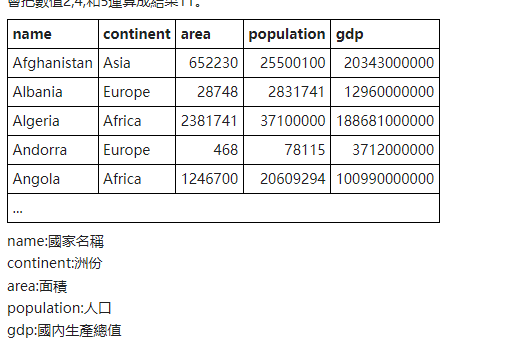

### study

#### 子查询

**eg**

放在select中的

显示中国人口是英国的多少倍

```sql
SELECT
 population/(SELECT population FROM world
             WHERE name='United Kingdom')
  FROM world
WHERE name = 'China'
```

放在where部分的

```sql
SELECT name FROM world WHERE continent = 
(SELECT continent 
FROM world WHERE name = 'Brazil')
```

当放在where部分的结果不唯一的时候使用in

列出與巴西'Brazil' 和 墨西哥'Mexico'相同洲份的每個國家名和洲份

in 指代的是多个选项中的某一个，但是不会缺少

```sql
SELECT name, continent FROM world
WHERE continent IN
  (SELECT continent 
     FROM world WHERE name='Brazil'
                   OR name='Mexico')

```

#### AS

作为输入或者输出的列名

```sql
SELECT COUNT(*) AS country_count
FROM world
WHERE area >= 1000000;

```


#### all的作用

**提问**

 其中的all有什么作用，能不能给出更多的使用了all的例子并解释

```sql
SELECT name FROM world WHERE population > ALL
(SELECT population FROM world 
 WHERE continent='Europe')
```

**回答**

在上述SQL查询中，`ALL` 是一个关键字，用于与子查询一起比较，以确定主查询中的条件是否对所有子查询的结果都成立。具体来说，此查询是要查找世界各国的名称，但仅限于那些人口多于欧洲所有国家的国家。

总之，`ALL` 关键字用于比较主查询中的条件与子查询中的所有结果。主查询将返回满足条件的行，如果主查询条件对所有子查询结果都成立，则返回结果行。这对于执行比较和筛选操作非常有用，可以根据不同的场景用于查询中。

eg

**查询高于平均值的值**：

```sql
SELECT name, population
FROM world
WHERE population > ALL (SELECT AVG(population) FROM world);

```


#### 群组函数

例如count，sum，avg

数据类型




**DISTINCT 唯一值查询**

```sql
SELECT DISTINCT continent
FROM world;
```


**count**

找出非洲(Africa)的GDP總和。

```sql
SELECT SUM(gdp) AS total_gdp
FROM world
WHERE continent = 'Africa';

```


count和in的结合

('France','Germany','Spain')（“法國”，“德國”，“西班牙”）的總人口是多少？


**原来in也可以用为count的数据范围，还可以这样用**

```sql
SELECT SUM(population) AS total_population
FROM world
WHERE name IN ('France', 'Germany', 'Spain');

```


**group by 和 having的结合**

列出有至少100百萬(1億)(100,000,000)人口的洲份。

```sql
SELECT continent, SUM(population) AS total_population
FROM world
GROUP BY continent
HAVING SUM(population) >= 100000000;
```


**having的作用**

`HAVING` 子句用于在 SQL 查询中对分组后的结果集进行筛选。它通常与 `GROUP BY` 子句一起使用，以筛选具有特定聚合条件的组。`HAVING` 子句的作用是在分组后的结果上进行条件筛选，与 `WHERE` 子句不同，后者用于筛选原始数据行。

ps ： 通常和group by一起使用，作为筛选完的数据的二次筛选


#### 排序

语法为 **order by** +"要排序的字段" +ASC/DESC    （升序排序/降序排序）

 **进阶 多元排序**

在column1的升序排序的基础上对column2进行降序排序

```sql
SELECT column1, column2, column3
FROM table_name
ORDER BY column1 ASC, column2 DESC;
```


### 困惑解答

#### 分组排序输出

##### **数据源**


##### 问题

查询每个国家的gdp情况和国家名称，并根据排名的10%，10%-20%，20%-50%，其他 ，输出结果

```sql
WITH ranked_countries AS (
  SELECT
    name,
    gdp,
    NTILE(10) OVER (ORDER BY gdp DESC) AS gdp_rank
  FROM world
)

SELECT
  name,
  gdp,
  CASE
    WHEN gdp_rank = 1 THEN 'Top 10%'
    WHEN gdp_rank = 2 THEN '10%-20%'
    WHEN gdp_rank <= 5 THEN '20%-50%'
    ELSE 'Other'
  END AS gdp_range
FROM ranked_countries;

```

##### 输出结果

```
这个查询首先使用 NTILE 窗口函数将国家按照 GDP 值的排名分为10个per，然后使用 CASE 表达式，根据 gdp_rank 的不同值为每个国家分配 gdp_range 标签。具体来说：

如果 gdp_rank 等于 1，那么该国家被标记为 'Top 10%'。
如果 gdp_rank 等于 2，那么该国家被标记为 '10%-20%'。
如果 gdp_rank 小于等于 5，那么该国家被标记为 '20%-50%'。
否则，即 gdp_rank 大于5，该国家被标记为 'Other'。
```


```sql
with rank_gdp as(
select county,gdp,
    //这个东西是新的一列
	ntile(10) over(order by gdp desc) as gdp_rank)
	from word
)

select county,gdp
	case 
		when gpd_rank =1 then "10%"
		when gdp_rank =2 then "20%"
		when gdp_rank <=5 then "50%"
        else 'Other'
    end as gdp_range
    //给case表达值的列分配一个别名
from rank_gdp;

```


##### ntile 窗口等分函数：

`NTILE` 是一种窗口函数，用于将结果集的行分成指定数量的等分区域，以便进行排名或分布分析。它通常与 `ORDER BY` 子句一起使用，以按指定的列对结果进行排序。

```sql
NTILE(number_of_buckets) OVER (ORDER BY column_name)
```


#### 分组排序输出进阶

##### **数据源**


##### 问题

不等额划分区间，在原来题目的基础上修改

区间划分改为10%，10%-20%，20%-40%，40%-65%,other,那应该怎么操作

##### 步骤


**先将元数据使用ntile划分成百分比的形式**

```sql
with ranked_gdp as（
	select name, gdp,
	ntile(100) over(order by gdp desc)as gdp_rank）
	from word)
)
```


**根据题目要求的边界计算边界值的大小**

- `CASE` 标记了 `CASE` 表达式的开始。
- `WHEN` 子句列出了不同的条件和相应的结果。
- `[ELSE result]` 是可选的，用于指定当没有条件匹配时要返回的默认结果。
- `END` 表示 `CASE` 表达式的结束。

下面代码的意思是获得gdp排名为10，20，40，65 的最大的那个值（如果排名中有重合的部分的时候）

```sql
boundary_value as (
	select 
    max(case when gdp_rank=10 then gdp end) as v_10;
    max(case when gdp_rank=20 then gdp end) as v_20;
    max(case when gdp_rank=40 then gdp end) as v_40;
    max(case when gdp_rank=65 then gdp end) as v_65;
)
```

**根据边界值的大小进行分组输出**

```sql
select 
	country,
	gdp,
	case 
		when gdp>=0 and gdp<=v_10 then '<10%'
		when gdp>=v_10 and gdp<=v_20 then '10%~20%'
		when gdp>=v_20 and gdp<=v_40 then '20%~40%'
		when gdp>v_40  and gdp<=v_65% then '40%~65%'
		else 'others'
	end as gdp_range
from ranked_country
join boundary_valuse on 1=1;
```

**解释**

在这个特定查询中，`boundary_values` 子查询生成了一个包含特定百分位数（10、20、40）的 GDP 分界值的结果集，而 `ranked_countries` 子查询包含了国家的 GDP 数据和百分位数排名。通过使用笛卡尔积连接，每个 `ranked_countries` 中的国家行都会与 `boundary_values` 中的每个百分位数行进行连接。

`1=1` 是一个始终为真的条件，因此连接操作会将 `ranked_countries` 中的每一行与 `boundary_values` 中的每一行进行连接，而不会进行实际的条件筛选。这意味着每个国家都会与每个百分位数行进行连接，而不受特定条件的约束。

这种笛卡尔积连接通常不是常见的连接方式，因为它会产生大量的结果行。通常情况下，连接操作会基于特定的连接条件来筛选连接的行，以确保只有相关的行被连接。在您的查询中，这种连接方式可能是因为 `boundary_values` 子查询只包含了少数特定的百分位数值，所以它希望每个国家都与这些值进行连接。
